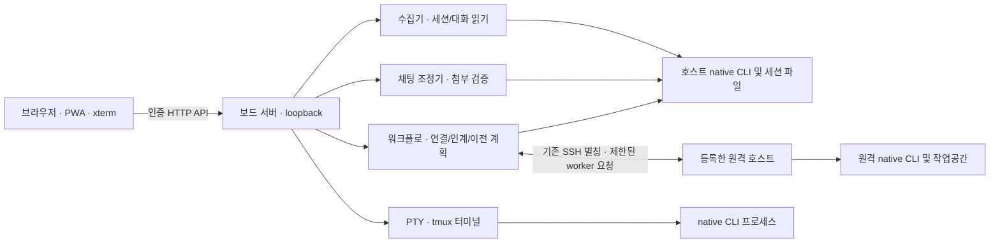

# 아키텍처

세션홀릭(Sessionholic)은 개인이 관리하는 macOS 호스트의 Claude Code·Codex CLI 세션을 발견하고, 선택한 세션의 상태·대화·실행 위치를 이어주는 self-hosted 애플리케이션입니다. 앱 자체가 모델을 실행하거나 native CLI 인증을 소유하지 않습니다. 브라우저는 로컬 보드 서버와 통신하고, native 세션·파일·CLI 명령은 이를 소유한 호스트에서 처리합니다.

## 요청 경로

1. `web/`은 정적 모바일·데스크톱 화면입니다. 목록 조회, 세션 상세, 직접 메시지, 실행 계획과 터미널 입출력을 인증된 서버 API에 요청합니다. 대화와 터미널 출력은 서비스 워커의 오프라인 캐시에 넣지 않습니다.
2. `server.py`는 loopback 전용 HTTP 서버, 브라우저 인증, 세션 상태 캐시, `Board`, `Workflow`, `Chat`, `TerminalManager`를 구성합니다. 연결된 화면의 요청에 따라 등록 호스트를 순차 수집합니다.
3. `collector.py`는 호스트에서 Claude Code·Codex의 세션 상태와 최근 대화를 읽습니다. 원격 조회는 기존 SSH 별칭을 통해 수집기 코드를 표준 입력으로 전달합니다. 이는 사용자의 SSH 연결과 원격 native CLI 설치·로그인을 전제로 합니다.
4. `Workflow`는 선택된 세션·계정·호스트를 다시 확인하고 연결 계획을 만듭니다. 같은 native 세션 연결, 최근 맥락을 전달하는 새 native 실행, 새 작업 폴더를 준비하는 호스트 간 이전은 서로 다른 경로입니다.
5. `Chat`은 메시지·첨부 요청을 원본 세션이 있는 호스트로 전달하고 결과를 확인합니다. `native_chat.py`는 호스트별 native capability를 검사하고, `attachments.py`는 실제 세션의 작업 경로 안에서 파일을 안전하게 저장·검증합니다.
6. `terminal.py`는 서버가 검증한 native CLI 명령을 전용 tmux 세션과 PTY에서 실행합니다. 브라우저의 xterm은 해당 PTY에 연결된 터미널 화면입니다. 브라우저 연결을 닫는 것과 CLI 실행을 종료하는 동작은 별도입니다.

## 세션 전환 모델

- **연결:** 같은 호스트·native 계정·세션 ID의 기존 프로세스에 연결합니다.
- **인계:** 원본 최근 대화와 작업공간 맥락을 기록하고 대상 native CLI로 새 프로세스를 시작합니다. 기존 프로세스, 실행 turn, 승인 대기 상태를 다른 프로세스에 옮기지 않습니다.
- **기기 간 이전:** 대상 계정을 다시 확인한 뒤 원본 응답을 중단하고 선택된 작업공간과 최근 대화를 새 목적 폴더로 복사합니다. 파일을 검증하고 대상 호스트에서 새 native 세션을 준비합니다. 원본 폴더·대화 기록은 남습니다. 실행 프로세스 자체를 이동하는 기능은 아닙니다.

원격 연결·이전은 별도 daemon을 설치하지 않습니다. 필요한 제한된 helper 모듈을 표준 입력으로 전송하며, 원격 호스트에는 SHA-256으로 확인한 버전 파일을 개인 상태 디렉터리에 둘 수 있습니다. 사용자 native CLI의 인증 파일이나 설정 전체를 복사하지 않습니다.

## 로컬 설정 계약

비밀값이 아닌 호스트별 설정은 `~/.config/sessionholic/config.json`에 둡니다. `settings.py`는 버전 1 JSON의 `profiles`, `projects`, `environments`만 허용하며, 파일이 없으면 빈 profile/project와 기본 환경을 사용합니다. 과거 계정 라우터 설정을 자동으로 읽거나 변환하지 않습니다.

- `profiles`: `agent`, native 계정 경로 `home`, 사용자 표시 `label`, 실행 환경 `environment`를 지정합니다. 지원 agent는 `codex`와 `claude`입니다. Claude는 기본 `.claude` 환경만 지원하고, Codex profile 경로는 허용된 `.codex` 형식이어야 합니다.
- `projects`: 프로젝트 식별자·표시 이름·절대 또는 홈 상대 `root`·실행 환경을 지정합니다. 작업 경로가 여러 프로젝트 root에 속하면 가장 구체적인(긴) root가 적용됩니다.
- `environments`: 실행 환경의 label과 허용된 환경 변수만 지정합니다. 키는 `GH_CONFIG_DIR`, `GIT_CONFIG_GLOBAL`, `GIT_CONFIG_SYSTEM`, `GIT_CONFIG_NOSYSTEM`, `GIT_SSH_COMMAND`, `GIT_SSH`, `SSH_AUTH_SOCK`로 제한됩니다. 임의 키·환경변수 전체를 주입하는 기능이 아닙니다.
- 작업공간이 project root에 매칭되지 않으면 native profile의 `environment`를 사용하고, 지정이 없으면 `default`를 사용합니다. 새 실행 또는 기기 이전에서는 실제 출발 작업의 환경과 선택한 대상 profile의 환경 이름이 맞아야 합니다.
- 표시 label은 로그인 신원 검증 결과가 아닙니다. 설정에는 비밀값을 넣지 말고, 특히 SSH·Git 관련 경로와 명령은 사용자 권한으로 실행되는 설정으로 취급합니다.

기기 목록·SSH 별칭과 HTTP 서버 실행 옵션은 설치 안내의 예시 설정을 따릅니다. 외부 주소, 호스트, 계정, 토큰을 코드나 문서 예시에 고정하지 않습니다.

## 상태 보관

세션 캐시, 읽은 대화, terminal 등록, 요청 중복 방지 기록, 이전 진행 기록은 사용자의 지정 상태 디렉터리에 보관됩니다. 첨부 파일은 실행 호스트의 실제 작업 디렉터리 아래 `.sessionholic-attachments/`에 저장되며, 이전 파일 선택에 포함될 수 있습니다. 데이터는 계정 간이나 기기 간에 자동 동기화되지 않습니다.
